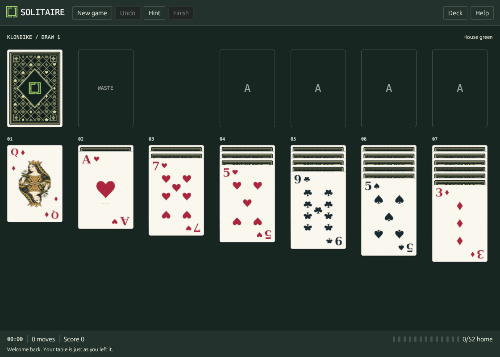
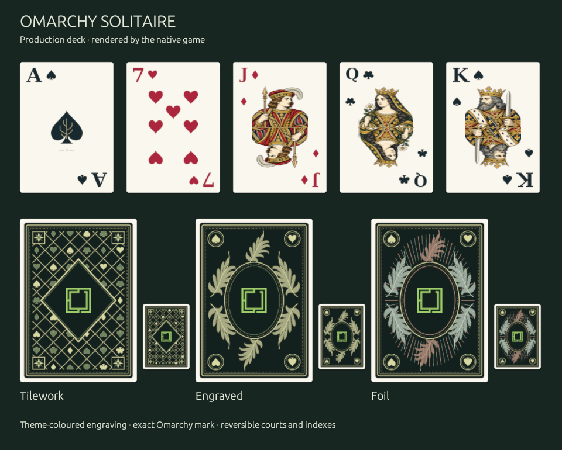

# Omarchy Solitaire

Native retro Klondike for Omarchy. Original illustrated cards, the official
Omarchy decal, and a table that follows your desktop theme.





Illustrated courts and ivory serif faces, with Tilework, Engraved and Foil
backs that follow your Omarchy palette.

## Play

- Draw one or three; unlimited stock recycling.
- Drag cards and complete sequences, or click a card and its destination.
- Double-click, right-click or press F to send a card to a foundation.
- Undo every move, including stock draws, recycling and automatic completion.
- Hints, restart the same deal, scoring, local statistics and save/resume.
- Animated dealing, flips, placement and invalid-drop returns; reduced motion.
- Keyboard play, visible legal targets and scrolling for unusually long columns.
- Three themed backs, optional holographic sheen and custom SVG/PNG artwork.

Random deals are **not guaranteed winnable**. Hints suggest legal moves; they are
not a solver. Finish is available when stock and waste are empty and every
tableau card is face up. The timer pauses in dialogs and inactive windows.

## Install on Omarchy / Arch

```sh
git clone https://github.com/tcballard/omarchy-solitaire.git
cd omarchy-solitaire
makepkg -si
```

Run `makepkg` as your ordinary user. Launch **Omarchy Solitaire** from the
application launcher, or run `omarchy-solitaire`.

CI builds an installable `arch-package` artifact. Extract it and install with:

```sh
sudo pacman -U ./omarchy-solitaire-*.pkg.tar.zst
```

The package contains a native Rust executable. There is no Python or Qt runtime
requirement, webview, account, telemetry, advertising or paid game feature.
The special-art file chooser uses the desktop portal already provided by Omarchy.

Tagged builds prepare a **draft** release. Actual Omarchy desktop acceptance is
still required before publishing a release; see [verification](docs/VERIFICATION.md).

## Build from source

Rust 1.98 or newer is required. On Arch, `makepkg -si` installs the build and
runtime dependencies. For Ubuntu development:

```sh
sudo apt install build-essential libegl1-mesa-dev libgl1-mesa-dev \
  libxkbcommon-dev libxkbcommon-x11-0 libwayland-dev libx11-dev libxi-dev libxcursor-dev libxrandr-dev
cargo run --locked --release
```

The desktop stack is Rust / egui / eframe, with native Wayland and X11 support.
The lockfile pins dependencies; game rules and save validation are separate
from the interface.

## Themes and special decks

Built-in Woven, Diamond and Minimal backs retain the official green Omarchy
mark. Table and back colours follow the active palette. Ivory card faces and
red/black suits stay readable across themes.

**Deck → Import a special card back** accepts static SVG or PNG and copies it
into local app storage. Imported artwork replaces the entire back. Artists
should include the Omarchy mark in their supplied design if desired. See the
[artwork handoff](docs/CARD-BACKS.md) for dimensions and validation rules.

Theme authors can provide `solitaire/back.svg` or `solitaire/back.png` inside
their theme. Palette and artwork changes are detected without changing the game.
Turn off **Follow the Omarchy theme** to preserve the current palette and artwork
across restarts. An explicitly selected Special back takes precedence.

Palette discovery checks:

1. `$XDG_STATE_HOME/omarchy/current/theme/colors.toml`, normally
   `~/.local/state/omarchy/current/theme/colors.toml`.
2. The fixed default state path when a different XDG path is configured.
3. `$XDG_CONFIG_HOME/omarchy/current/theme/colors.toml`, normally
   `~/.config/omarchy/current/theme/colors.toml`.

House green is the fallback. Invalid or partially replaced palette files retain
the last valid colours. The app never executes theme scripts or loads remote art.

## Controls

| Action | Control |
| --- | --- |
| Select / place | Click, or Enter on the table |
| Move a sequence | Drag its first face-up card |
| Move to foundation | Double-click, right-click, or F |
| Draw / recycle | Click stock, or Space on the table |
| Navigate piles / cards | Left/right, up/down |
| Clear selection / stop Finish | Escape |
| Undo | Ctrl+Z |
| Hint | H |
| New / restart | Ctrl+N |
| Deck settings | Ctrl+, |
| Help / quit | F1 / Ctrl+Q |

Tab moves between controls and cards. Focus, selection and legal destinations
have visible outlines or arrow markers. Dialogs block gameplay input.

## Saves and upgrading from Python

The Rust app resumes the previous Python app's `session.json`, including the
entire undo history, score, time, statistics, preferences and locked theme.
It reproduces Python's seeded shuffle, so **Restart this deal** keeps the same
cards. The original file is preserved as `session-before-rust.json` before the
first Rust save.

Data lives in `$XDG_STATE_HOME/omarchy-solitaire`, normally
`~/.local/state/omarchy-solitaire`. Back up that directory to move games and art.
Close the Python app before upgrading. One app owns each save directory at a
time. A stale local lock is recovered when its process is gone. If an unrecognized
`session.lock` remains, remove it only after confirming no Solitaire process is running.

Saves are atomic and private to the user. Each move saves immediately; the
clock saves every ten seconds and on normal exit. An abrupt kill can lose up to
ten seconds of elapsed time. Files over 32 MB or invalid arrangements are
preserved as `session-unreadable-*.json` before starting a new deal. If recovery
fails, saving is disabled and the original file stays untouched. Save errors
appear in the status bar.

A deal counts at its first move, and can add only one win. Restarts and undo
don't inflate statistics. Scores: +10 to foundations, +5 waste to table, +5
reveal, −15 foundation to table, −20 recycle, with a zero floor. Undo restores
the score; elapsed time is not undone. No time bonuses or Vegas scoring.

## Development

```sh
cargo fmt --check
cargo clippy --locked --all-targets -- -D warnings
cargo test --locked
cargo build --locked --release
xvfb-run -a env LIBGL_ALWAYS_SOFTWARE=1 \
  python tools/render_previews.py --binary target/release/omarchy-solitaire
```

The optional preview script uses Python's standard library; the app does not.
Native screenshots can also be captured directly:

```sh
omarchy-solitaire --state-dir /tmp/solitaire-preview \
  --width 800 --height 600 --screenshot /tmp/solitaire.png
```

Tests compare against saved outputs from the original Python engine, exercise
random play and full undo, validate recovery and artwork, and drive real egui
pointer and keyboard events. CI builds, installs, launches and removes the Arch
package. See [decisions](docs/DECISIONS.md) and [verification](docs/VERIFICATION.md)
for scope and remaining desktop checks.

## Attribution

New code and original card illustrations: MIT. Official Omarchy mark: separate
rights retained, see [NOTICE](NOTICE). Dependency and bundled font notices are in
[THIRD_PARTY.md](THIRD_PARTY.md). This is a community application and claims no
Foundation endorsement. No Microsoft artwork, executables or game assets are used.
